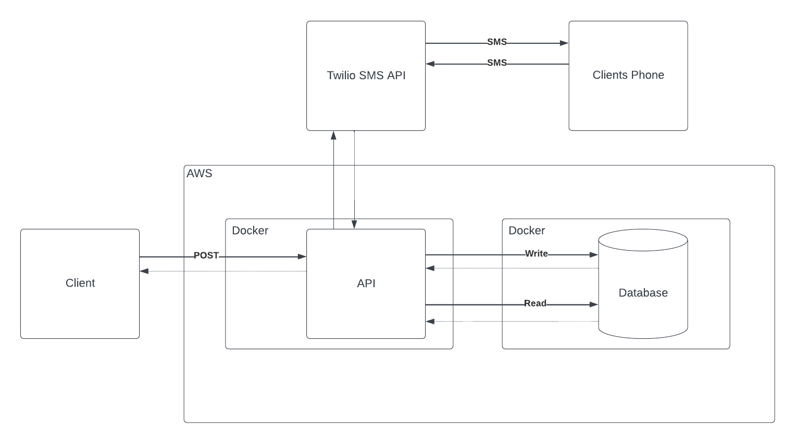
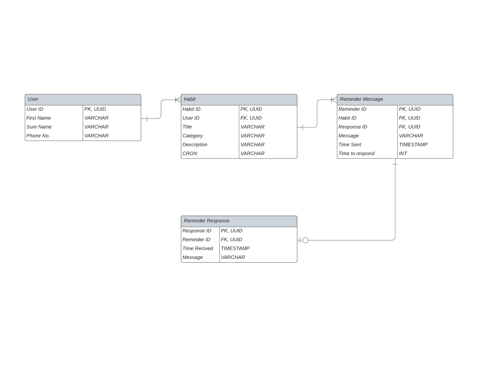
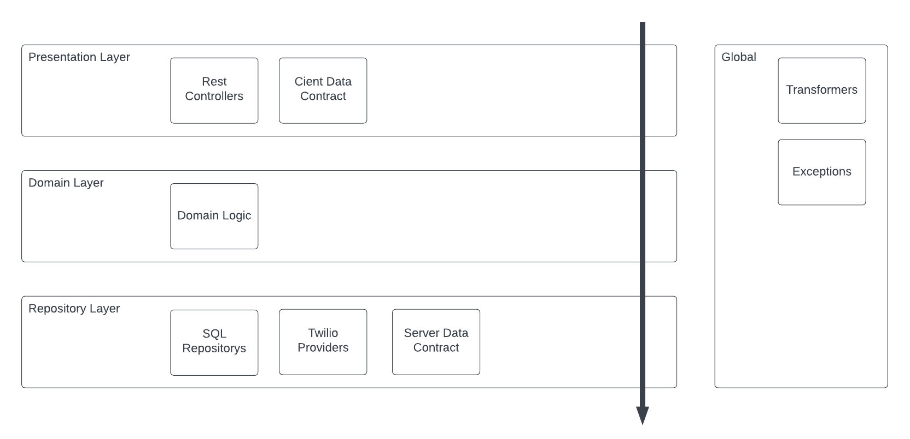

# SMS Habit Tracker

A Simple Habit Tracking Application to help you complete any habits you set yourself.
Supports adding users via post requests to the API. Once a user is created add habits to users using the following JSON payload template <insert template here>. 

Habit reminders will be sent to you via SMS using the twilio API and data around each reminder will be stored. 

CRON field in the above request will determin how the SMS message will be scheduled.

Below find the diagrams outlining the overall high-level architecture for this projects MVP

Overall Archetecture:

Database Entity Relationship Diagram:

API Archectecture:

